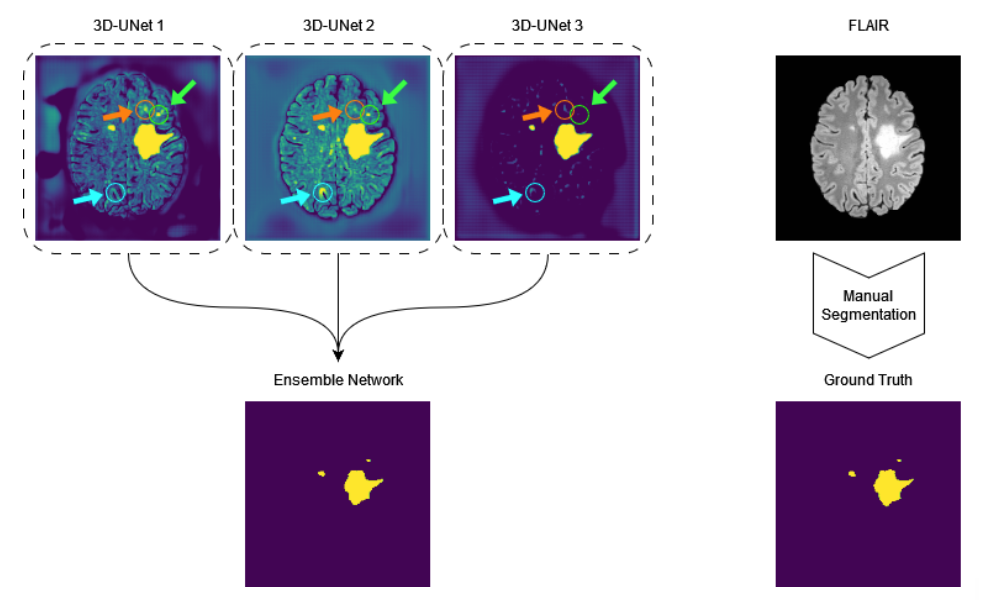

# LST-AI - Deep Learning Ensemble for Accurate MS Lesion Segmentation

Welcome to our codebase for LST-AI, the deep learning-based successor of the original [Lesion Segmentation Toolbox (LST)](https://www.applied-statistics.de/lst.html) by [Schmidt et al.](https://www.sciencedirect.com/science/article/abs/pii/S1053811911013139)
LST-AI was collaboratively developed by the Department of Neurology and Department of Neuroradiology, Klinikum rechts der Isar at the Technical University of Munich, and the Department of Computer Science at the Technical University of Munich.




**Disclaimer:** LST-AI is a research-only tool for MS Lesion Segmentation and has not been validated, licensed or approved for any clinical usage.

## What is different, why or when should I switch?!
* LST-AI is an advanced deep learning-based extension of the original LST with improved performance and additional features.
* LST-AI constitutes a completely new framework and has been developed from scratch.
* While LST depends on MATLAB, we offer LST-AI as a python-based tool which makes it available to the whole community.
* We suggest using LST or LST-AI according to your type of data:
    * A 3D T1-weighted and a 3D FLAIR sequence are available: (new) LST-AI
    * Only a 3D FLAIR sequence is available: (old) [LST](https://www.applied-statistics.de/lst.html) (LPA)
    * Only a 3D T1-weighted sequence is available: not covered by any LST(-AI) version
    * If a 3D T1-weighted and a non-3D FLAIR sequence are available, please try both (new) LST-AI or (old) [LST](https://www.applied-statistics.de/lst.html) (LGA or LPA)


## Usage
To allow the usage of LST-AI on different platforms and online/offline usage, we provide LST-AI as a Python package and Docker (CPU and GPU-Docker versions available).

### Installing the Python package

LST-AI is a Python-based package. For Debian-based systems, you can install all required packages via `apt`:

```
apt-get update && apt-get install -y \
git \
wget \
unzip \
python3 \
python3-pip
```

Under the hood, LST also wraps [HD-BET](https://github.com/MIC-DKFZ/HD-BET) and [greedy](https://github.com/pyushkevich/greedy).
We guide you through the download/compilation for greedy and installation for HD-BET in the following process. If you encounter specific issues with these packages, let us know in an issue and/or consult the GitHub repositories.

1. Make a new directory for LST-AI
```bash
mkdir lst_directory
cd lst_directory
```

2. We recommend setting up a virtual environment for LST-AI:
```bash
python3 -m venv /path/to/new/lst/virtual/environment
```

3. Activate your new environment, e.g. `(lst_env)`
```bash
source /path/to/new/lst/virtual/environment/bin/activate
```

4. Install LST-AI (and yes, with `pip -e` option!):
```bash
git clone https://github.com/CompImg/LST-AI/
cd LST-AI
pip install -e .
cd ..
```

4. Install [HD-BET](https://github.com/MIC-DKFZ/HD-BET)
```bash
git clone https://github.com/MIC-DKFZ/HD-BET
cd HD-BET
git checkout ae160681324d524db3578e4135bf781f8206e146
pip install -e .
cd ..
```

5. Download or Compile and install greedy for your platform
  * 6.1 (Variant A): Download the pre-built greedy tool and place it into structure
    1) Download the tool
    ```bash
    wget "https://github.com/CompImg/LST-AI/releases/download/v1.0.0/greedy"
    ```
    2) and ensure it is a findable path:
    ```bash
    chmod +x greedy
    mkdir ~/bin
    mv greedy ~/bin
    export PATH="$HOME/bin:$PATH"
    ```
    Naturally, you can place the binary in ANY directory if you add it to your `.bashrc` and export the location to the `$PATH`.
  * 6.2 (Variant B): Compile, make, and install the greedy tool (you will need to install both, VTK and ITK)
    ```
    apt-get update && apt-get install -y \
    build-essential \
    libpng-dev \
    libtiff-dev \
    uuid-dev \
    make \
    cmake \
    g++ \
    libgl1-mesa-dev

    wget https://github.com/InsightSoftwareConsortium/ITK/archive/refs/tags/v5.2.1.tar.gz
    tar -zxvf v5.2.1.tar.gz
    cd ITK-5.2.1
    mkdir build
    cd build
    cmake ..
    make -j$(nproc)
    make install

    wget https://www.vtk.org/files/release/9.1/VTK-9.1.0.tar.gz
    tar -xf VTK-9.1.0.tar.gz
    cmake ..
    make -j$(nproc)
    make install

    git clone https://github.com/pyushkevich/greedy greedy
    cmake ../greedy
    make -j$(nproc)
    make install
    ```

### Usage of LST-AI

Once installed, LST-AI can be used as a simple command line tool. LST-AI expects you to provide **zipped NIFTIs (*.nii.gz)** as input and assumes the input images **NOT** to be **skull-stripped**. If you already have skull-stripped images, **do not forget** to provide the **--skull-stripped** option, otherwise, the segmentation performance will be severely affected.

LST-AI always requires you to provide a `--t1` T1w and `--flair` FLAIR image and to specify an output path for the segmentation results `--output`. If you would like to keep all processing files, for example, the segmentations and skull-stripped images in the MNI152 space, provide a directory via `--temp`.

#### Example usage:
```
(lst_env) jqm@workstation: lst --t1 t1.nii.gz --flair flair.nii.gz --output /mnt/data/lst/results --temp /mnt/data/lst/processing
```

#### Modes

We provide three different modes:

1. **Default Mode - Segmentation + Annotation**: In this mode, you only need to provide the T1w and FLAIR input images. LST-AI will automatically segment and annotate your lesions according to McDonald's criteria.

2. **Segmentation Only**: If you only care about the binary segmentation, and not about the annotation/class (perventricular, ...), this mode is for you. It will (only) save the binary segmentation mask. To execute it, provide the `--segment_only` flag to run it.

3. **Annotation Only**: If you already have a satisfactory binary segmentation mask for your T1w/FLAIR images, you can only use the annotation/region labeling function. Please provide your existing segmentation via `--existing_seg /path/to/binary/mask`, and provide the `--annotate_only` flag to run it. We assume that the lesion mask is provided in the FLAIR image space.

#### Other (useful) settings

- `--temp `: If you would like to access intermediate pipeline results such as the skull-stripped T1w, and FLAIR images in MNI152 space, please provide a temporary directory using this flag. Otherwise, we create a temporary directory on the fly and remove it once the pipeline has finished.
- `--device`: Provide an integer value (e.g. `0`) for a GPU ID or `cpu` if you do not have access to a GPU.
- `--stripped`: Bypass skull-stripping. Only use if your images are (actually) skull-stripped. We cannot handle a mixture (e.g. skull-stripped T1w, but non-skull-stripped FLAIR) as of now.
- `--threshold`: Provide a value between `0` and `1` that defines the threshold which is applied to the lesion probability map generated by the ensemble network to create the binary lesion mask. The default setting is 0.5.
- `--clipping`: This flag can be used to define lower and upper percentiles that are used as min & max for standardization of image intensities in pre-processing. Changing these parameters can have an effect on the sensitivity of the segmentation process (e.g., higher max can yield higher sensitivity). The default setting is `0.5 99.5`, which indicates that the min is defined as the 0.5 percentile and the max is defined as the 99.5 percentile.
- `--probability_map`: Save the lesion probability maps of the ensemble network and of each individual 3D UNet model of the ensemble network. The `--temp` flag must be set, otherwise the files will be removed as they are stored in the temporary directory along with the intermediate pipeline results.  


### Dockerfile and Dockerhub

While the installation and usage require internet access to install python packages and to download the weights and atlas, we understand that some researchers prefer to use lst-ai offline. Thus, we have decided to provide lst-ai as a CPU-/GPU-enabled docker container, which can be compiled using our scripts (for instructions please check the docker directory). If, instead of building the docker yourself, you would just rather use it, you can pull it from dockerhub instead.

While we used to maintain jqmcginnis/lst-ai_cpu, we encourage everyone to use the unified jqmcginnis/lst-ai instead (CPU/GPU enabled), featuring the newest LST-AI version. 
You can pull it from dockerhub via executing:

```bash
docker pull jqmcginnis/lst-ai:v1.2.0
```

### Running the LST-AI Docker Container
Once you have pulled (or built) your Docker image using the Dockerfile provided you can run the container using the `docker run` command. Here are the steps to bind mount your files and retrieve the results:

#### Run the Docker Container with Bind Mounts
The primary mechanism for sharing files between your host system and the Docker container is the `-v` or `--volume` flag, which specifies a bind mount.

Here's a breakdown of how to use bind mounts:
```bash
docker run -v [path_on_host]:[path_in_container] [image_name]
```

Given our provided GPU Dockerfile command, the run command might look something like this:

```bash
docker run -v /home/ginnis/lst_in:/custom_apps/lst_input -v /home/ginnis/lst_out/:/custom_apps/lst_output -v /home/ginnis/lst_temp/:/custom_apps/lst_temp lst:latest --t1 /custom_apps/lst_input/t1.nii.gz --flair /custom_apps/lst_input/flair3d.nii.gz --output /custom_apps/lst_output --temp /custom_apps/lst_temp
```

__Note__: Ensure your paths are absolute, as Docker requires absolute paths for bind mounts. Since you've bind-mounted your output directory to `/home/ginnis/lst_out/` on your host, the results from the Docker container will be written directly to this directory. No additional steps are needed to retrieve the results, they will appear in this directory after the container has finished processing.

#### Extending and modifying LST-AI for your custom code and pipeline

We invite you to tailor LST-AI to your pipeline and application, please have a look at our [sources](LST-AI).

### BIDS Compliance with LST-AI

To ensure maximum flexibility for our user base, LST-AI does not natively enforce BIDS-compliant file-naming conventions. This decision allows users to work seamlessly with both BIDS and non-BIDS datasets.

However, for those who wish to utilize LST-AI within a BIDS-compliant workflow, we have provided an [example repository](https://github.com/twiltgen/LST-AI_BIDS) that demonstrates the integration of LST-AI with BIDS-compliant data. This example reflects the BIDS-compliant usage of LST-AI that we are currently using in our internal database.

### Citation

Please consider citing [LST-AI](https://www.medrxiv.org/content/10.1101/2023.11.23.23298966) to support the development:
```
@article{wiltgen2024lst,
  title={LST-AI: A deep learning ensemble for accurate MS lesion segmentation},
  author={Wiltgen, Tun and McGinnis, Julian and Schlaeger, Sarah and Kofler, Florian and Voon, CuiCi and Berthele, Achim and Bischl, Daria and Grundl, Lioba and Will, Nikolaus and Metz, Marie and others},
  journal={NeuroImage: Clinical},
  pages={103611},
  year={2024},
  publisher={Elsevier}
}
```

Further, please also credit [greedy](https://greedy.readthedocs.io/en/latest/), and [HD-BET](https://github.com/MIC-DKFZ/HD-BET) used for preprocessing the image data.

greedy
```
@article{yushkevich2016ic,
  title={IC-P-174: Fast Automatic Segmentation of Hippocampal Subfields and Medial Temporal Lobe Subregions In 3 Tesla and 7 Tesla T2-Weighted MRI},
  author={Yushkevich, Paul A and Pluta, John and Wang, Hongzhi and Wisse, Laura EM and Das, Sandhitsu and Wolk, David},
  journal={Alzheimer's \& Dementia},
  volume={12},
  pages={P126--P127},
  year={2016},
  publisher={Wiley Online Library}
}
```

HD-BET:
```
@article{isensee2019automated,
  title={Automated brain extraction of multisequence MRI using artificial neural networks},
  author={Isensee, Fabian and Schell, Marianne and Pflueger, Irada and Brugnara, Gianluca and Bonekamp, David and Neuberger, Ulf and Wick, Antje and Schlemmer, Heinz-Peter and Heiland, Sabine and Wick, Wolfgang and others},
  journal={Human brain mapping},
  volume={40},
  number={17},
  pages={4952--4964},
  year={2019},
  publisher={Wiley Online Library}
}
```
