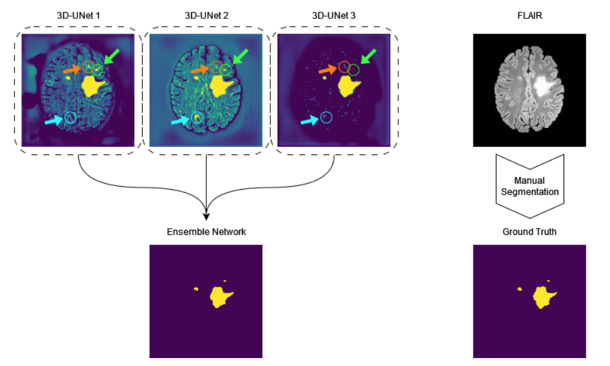

# LST-AI - Deep Learning Ensemble for Accurate MS Lesion Segmentation

> 2026-05-06: **LST-AI has received the [NeuroImage: Clinical Editors’ Choice Award 2025](https://www.sciencedirect.com/journal/neuroimage-clinical/about/editor-choice/neuroimage-clinical-editors-choice-award-2025-tun-wiltgen) 🏆**

Welcome to our codebase for LST-AI, the deep learning-based successor of the original [Lesion Segmentation Toolbox (LST)](https://www.applied-statistics.de/lst.html) by [Schmidt et al.](https://www.sciencedirect.com/science/article/abs/pii/S1053811911013139)
LST-AI was collaboratively developed by the Department of Neurology and Department of Neuroradiology, Klinikum rechts der Isar at the Technical University of Munich, and the Department of Computer Science at the Technical University of Munich.




**Disclaimer:** LST-AI is a research-only tool for MS Lesion Segmentation and has not been validated, licensed or approved for any clinical usage.

## What is different, why or when should I switch?!
* LST-AI is an advanced deep learning-based extension of the original LST with improved performance and additional features.
* LST-AI constitutes a completely new framework and has been developed from scratch.
* While LST depends on MATLAB, we offer LST-AI as a python-based tool which makes it available to the whole community.
* We suggest using LST or LST-AI according to your type of data:
    * A 3D T1-weighted and a 3D FLAIR sequence are available: (new) LST-AI
    * Only a 3D FLAIR sequence is available: (old) [LST](https://www.applied-statistics.de/lst.html) (LPA)
    * Only a 3D T1-weighted sequence is available: not covered by any LST(-AI) version
    * If a 3D T1-weighted and a non-3D FLAIR sequence are available, please try both (new) LST-AI or (old) [LST](https://www.applied-statistics.de/lst.html) (LGA or LPA)


## Installation

LST-AI installs from PyPI. Inference runs in **PyTorch** — there is no TensorFlow, no ONNX
Runtime and, since v2.0.0, no `onnx` dependency either: the released weights ship as `.pt`
checkpoints. `greedy` (registration), HD-BET (skull stripping) and FastSurfer's
dependencies install as wheels on every supported platform, so nothing is compiled.

```bash
python3 -m venv lst_env && source lst_env/bin/activate
pip install lst-ai
```

While 2.0.0 is in its release-candidate phase, pip needs to be told that a
pre-release is acceptable: `pip install --pre lst-ai` (or pin it explicitly,
`pip install lst-ai==2.0.0rc1`). Once the final 2.0.0 is published, the plain command
above is all there is.

The model bundle and atlas are downloaded automatically on first run; they land next to
the installed `lst_ai` package when that directory is writable (any venv install), and
fall back to `~/.cache/lst_ai` when it is not. Set `LST_AI_DATA_DIR` to override the
location. Lesion annotation runs on FastSurfer, which the install brings along — see
[Lesion annotation with FastSurfer](#lesion-annotation-with-fastsurfer). Nothing has to
be set up by hand.

<details>
<summary><b>GPU users: check your driver against PyTorch's default CUDA build</b></summary>

The `torch` wheels on PyPI now target CUDA 13, which needs an R580+ driver; on an older
driver (anything reporting CUDA ≤ 12.8 in `nvidia-smi`) the install succeeds but
`torch.cuda.is_available()` is `False`, so every GPU run fails at startup ("driver too
old") and only `--device cpu` works. Install torch from the index matching your driver
*before* installing `lst-ai`, e.g.:

```bash
pip install --index-url https://download.pytorch.org/whl/cu126 torch
```

The GPU Docker image is pinned to cu126 and does not have this problem.
</details>

<details>
<summary><b>Alternative: installing with <code>uv</code></b></summary>

If your system Python is older than 3.10 (LST-AI's floor) or you simply want faster
installs, [`uv`](https://docs.astral.sh/uv/) fetches a suitable interpreter itself, so
nothing has to be installed system-wide:

```bash
uv venv --python 3.12 lst_env && source lst_env/bin/activate
uv pip install lst-ai
```

Note the `uv pip install` — a venv created by `uv venv` deliberately ships without
`pip`, so a plain `pip install` would fail inside it.
</details>

<details>
<summary><b>Development install (working on LST-AI itself)</b></summary>

```bash
python3 -m venv lst_env && source lst_env/bin/activate
git clone https://github.com/CompImg/LST-AI/ && cd LST-AI
pip install -e .
```

`training/` trains the same network this package runs at inference — single-channel
(FLAIR) or dual-channel (FLAIR + T1). It imports `lst_ai.model` rather than copying it,
so what you train is what ships. See [training/README.md](training/README.md).
</details>

### What happened to TensorFlow?

Inference was reimplemented natively in PyTorch for v2.0.0. The **released weights are
unchanged** — every tensor matches the released `.h5` bit-for-bit; nothing was retrained.
Validated against the released TensorFlow models on 10 subjects, full ensemble:
Dice agreement **0.99565**, lesion volume difference **−0.12 %**, lesion Dice vs
consensus ground truth 0.6829 (TF) vs 0.6835 (PyTorch). For scale: running the identical
code in a container rather than a virtualenv moves the result more (Dice 0.883) than the
framework swap does, because greedy's registration is nondeterministic run to run.

Details, the retired ONNX backend's drift, and guidance for comparing against earlier
results: [docs/pytorch-reimplementation.md](docs/pytorch-reimplementation.md). The
release validation checklist, including what remains untested:
[docs/testing.md](docs/testing.md) — further "worked for me" reports, especially from
aarch64 and CPU-only machines, are genuinely useful.

### Lesion annotation with FastSurfer

Lesions are assigned to anatomical regions using a [FastSurfer](https://github.com/Deep-MI/FastSurfer)
segmentation of the T1. Every mode except `--segment_only` runs it, so FastSurfer is a
hard requirement of a normal `lst` run — and both the pip install and the Docker image
bring their own pinned copy with them, found without any `FASTSURFER_HOME` or `PATH`
setup. A FastSurfer already on the machine is deliberately ignored, so an annotation
never depends on what a given machine happens to have lying around.

How the install works, pre-fetching checkpoints for offline machines, and
`LST_AI_SKIP_FASTSURFER`: [docs/fastsurfer.md](docs/fastsurfer.md).

## Usage

Once installed, LST-AI is a command line tool. It expects **zipped NIFTIs (*.nii.gz)**
as input and assumes the input images are **not** skull-stripped (if yours are, pass
`--stripped`, or segmentation performance will be severely affected).

```bash
lst --t1 t1.nii.gz --flair flair.nii.gz --output /mnt/data/lst/results --temp /mnt/data/lst/processing
```

`--t1`, `--flair` and `--output` are required. `--temp` keeps the intermediate files
(e.g. skull-stripped images in MNI152 space); without it a temporary directory is used
and removed afterwards.

#### Modes

1. **Default — Segmentation + Annotation**: provide the T1w and FLAIR images; LST-AI
   segments and annotates lesions according to McDonald criteria.
2. **Segmentation only** (`--segment_only`): only the binary segmentation mask is saved.
3. **Annotation only** (`--annotate_only`): annotate an existing binary mask, provided
   in FLAIR space via `--existing_seg /path/to/binary/mask`.

#### Common settings

- `--device`: integer GPU ID, or `cpu`. **The default is `0`, i.e. GPU 0.** On a machine
  without a GPU — including the CPU Docker image — you must pass `--device cpu`.
- `--stripped`: inputs are already skull-stripped (both of them — a mixture is not
  supported).
- `--threshold`: threshold applied to the ensemble's lesion probability map to produce
  the binary mask (default `0.5`).

<details>
<summary><b>All other flags</b></summary>

- `--lesion_threshold`: Minimum lesion size in **mm³**. Connected components smaller than this are dropped from the binary mask. The default is `0`, i.e. no size filtering.
- `--clipping`: Lower and upper percentiles used as min & max for standardization of image intensities in pre-processing (default `0.5 99.5`). Changing these can affect the sensitivity of the segmentation (e.g., higher max can yield higher sensitivity).
- `--probability_map`: Save the lesion probability maps of the ensemble network and of each individual 3D UNet model. Requires `--temp`, otherwise the files are removed along with the temporary directory.
- `--fast-mode`: Run HD-BET with a single model rather than its full ensemble, and without test-time augmentation. Faster skull-stripping, at some cost in mask quality.
- `--threads`: Number of threads used for registration. Defaults to all available cores.
</details>

## Dockerfile and Dockerhub

For offline or reproducible use, LST-AI ships as Docker images with every model weight
baked in — a container runs with no network access. Images are published to Docker Hub
under `jqmcginnis/lst-ai`, one CUDA and one CPU flavour per release, each as a
multi-arch manifest (linux/amd64 + linux/arm64):

```bash
docker pull jqmcginnis/lst-ai:v2.0.0        # CUDA flavour
docker pull jqmcginnis/lst-ai:v2.0.0-cpu    # CPU flavour
```

`latest` and `latest-cpu` track the newest stable release. Pre-releases are published
only under their explicit tag (e.g. `v2.0.0rc1`, `v2.0.0rc1-cpu`) and never move
`latest`, so a plain `docker pull jqmcginnis/lst-ai` cannot land on a candidate. The
legacy `jqmcginnis/lst-ai_cpu` repository and the v1.x tags remain for the old
TensorFlow-based images.

To build the images yourself — including behind a TLS-inspecting hospital or university
proxy — see [docker/Readme.md](docker/Readme.md).

### Running the container

Bind-mount your input and output directories (absolute paths — Docker requires them) and
pass the usual `lst` arguments:

```bash
# GPU image
docker run --gpus all \
  -v /home/ginnis/lst_in:/in -v /home/ginnis/lst_out:/out -v /home/ginnis/lst_temp:/temp \
  lst-ai:gpu --t1 /in/t1.nii.gz --flair /in/flair3d.nii.gz --output /out --temp /temp

# CPU image: no --gpus, and --device cpu is required
docker run \
  -v /home/ginnis/lst_in:/in -v /home/ginnis/lst_out:/out -v /home/ginnis/lst_temp:/temp \
  lst-ai:cpu --t1 /in/t1.nii.gz --flair /in/flair3d.nii.gz --output /out --temp /temp --device cpu
```

Results appear directly in the bind-mounted output directory.

<details>
<summary><b>Who owns the results: run as yourself</b></summary>

The container runs as root unless told otherwise. As root, everything it writes into your
bind-mounted output and temp directories comes out owned by `root`, and you need `sudo`
to clean it up.

FastSurfer makes this sharper: it *refuses to start* as root, precisely because
everything it writes would come out root-owned. LST-AI detects that case and passes
its `--allow_root`, so the annotation stage runs rather than aborting — but that only
unblocks the run, it does not change who ends up owning the files.

To own the results yourself, add `-u $(id -u):$(id -g)`:

```bash
docker run -u $(id -u):$(id -g) --gpus all -v /home/ginnis/lst_in:/in -v /home/ginnis/lst_out:/out lst-ai:gpu --t1 /in/t1.nii.gz --flair /in/flair3d.nii.gz --output /out
```

The bind-mounted directories have to be writable by that uid, which they are if they are
yours. Nothing else needs changing, and LST-AI drops
FastSurfer's `--allow_root` when it is not running as root.
</details>

## Extending and modifying LST-AI

We invite you to tailor LST-AI to your pipeline and application, please have a look at our [sources](lst_ai).

### BIDS Compliance with LST-AI

To ensure maximum flexibility for our user base, LST-AI does not natively enforce BIDS-compliant file-naming conventions. This decision allows users to work seamlessly with both BIDS and non-BIDS datasets.

However, for those who wish to utilize LST-AI within a BIDS-compliant workflow, we have provided an [example repository](https://github.com/twiltgen/LST-AI_BIDS) that demonstrates the integration of LST-AI with BIDS-compliant data. This example reflects the BIDS-compliant usage of LST-AI that we are currently using in our internal database.

## Citation

Please consider citing [LST-AI](https://www.medrxiv.org/content/10.1101/2023.11.23.23298966) to support the development:
```
@article{wiltgen2024lst,
  title={LST-AI: A deep learning ensemble for accurate MS lesion segmentation},
  author={Wiltgen, Tun and McGinnis, Julian and Schlaeger, Sarah and Kofler, Florian and Voon, CuiCi and Berthele, Achim and Bischl, Daria and Grundl, Lioba and Will, Nikolaus and Metz, Marie and others},
  journal={NeuroImage: Clinical},
  pages={103611},
  year={2024},
  publisher={Elsevier}
}
```

Further, please also credit [greedy](https://greedy.readthedocs.io/en/latest/) and [HD-BET](https://github.com/MIC-DKFZ/HD-BET), used for preprocessing the image data, and — unless you run `--segment_only` — [FastSurfer](https://github.com/Deep-MI/FastSurfer), which provides the anatomical parcellation lesions are assigned to.

<details>
<summary><b>BibTeX for greedy, HD-BET and FastSurfer</b></summary>

greedy
```
@article{yushkevich2016ic,
  title={IC-P-174: Fast Automatic Segmentation of Hippocampal Subfields and Medial Temporal Lobe Subregions In 3 Tesla and 7 Tesla T2-Weighted MRI},
  author={Yushkevich, Paul A and Pluta, John and Wang, Hongzhi and Wisse, Laura EM and Das, Sandhitsu and Wolk, David},
  journal={Alzheimer's \& Dementia},
  volume={12},
  pages={P126--P127},
  year={2016},
  publisher={Wiley Online Library}
}
```

HD-BET:
```
@article{isensee2019automated,
  title={Automated brain extraction of multisequence MRI using artificial neural networks},
  author={Isensee, Fabian and Schell, Marianne and Pflueger, Irada and Brugnara, Gianluca and Bonekamp, David and Neuberger, Ulf and Wick, Antje and Schlemmer, Heinz-Peter and Heiland, Sabine and Wick, Wolfgang and others},
  journal={Human brain mapping},
  volume={40},
  number={17},
  pages={4952--4964},
  year={2019},
  publisher={Wiley Online Library}
}
```

FastSurfer (used by every mode except `--segment_only`). LST-AI calls FastSurfer with
`--seg_only`, so it uses the FastSurferVINN whole-brain segmentation network rather than
the surface pipeline; cite both the pipeline paper and the VINN paper, as FastSurfer
itself asks:
```
@article{henschel2020fastsurfer,
  title={FastSurfer -- A fast and accurate deep learning based neuroimaging pipeline},
  author={Henschel, Leonie and Conjeti, Sailesh and Estrada, Santiago and Diers, Kersten and Fischl, Bruce and Reuter, Martin},
  journal={NeuroImage},
  volume={219},
  pages={117012},
  year={2020},
  publisher={Elsevier},
  doi={10.1016/j.neuroimage.2020.117012}
}

@article{henschel2022fastsurfervinn,
  title={FastSurferVINN: Building resolution-independence into deep learning segmentation methods -- A solution for HighRes brain MRI},
  author={Henschel, Leonie and K{\"u}gler, David and Reuter, Martin},
  journal={NeuroImage},
  volume={251},
  pages={118933},
  year={2022},
  publisher={Elsevier},
  doi={10.1016/j.neuroimage.2022.118933}
}
```
</details>
